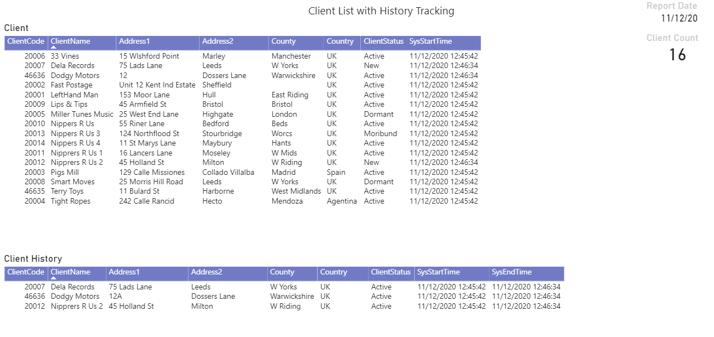

# Temporal Table SCD

Temporal Tables offer an easier route to capturing data changes. There are a few steps required to shape the data ready for ingestion into a multidiemsional Tabular model. 
In this article a simple toy Client example is used to show one possible execution.

## Client Report
Resulting report showing client currrent and history 

## Tabular Model
Simple model with Factless fact table and associated dimensions

