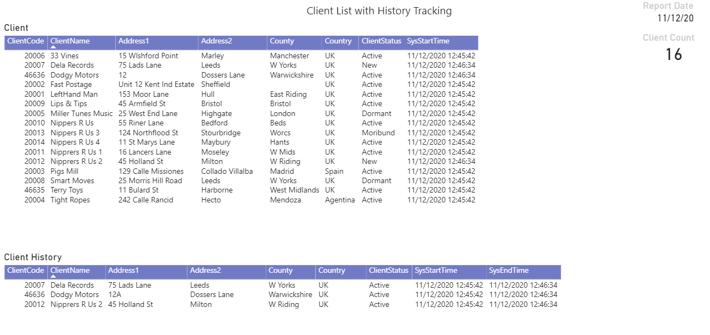
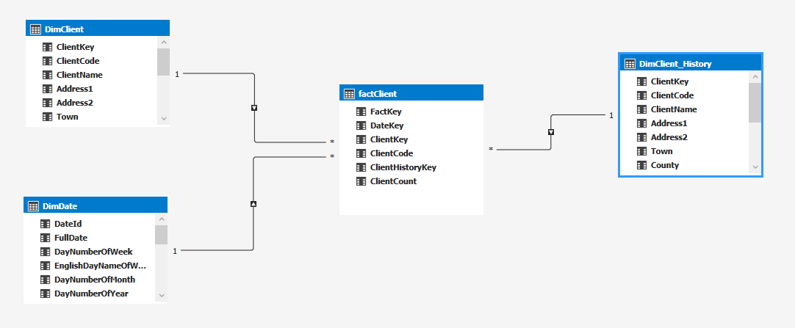
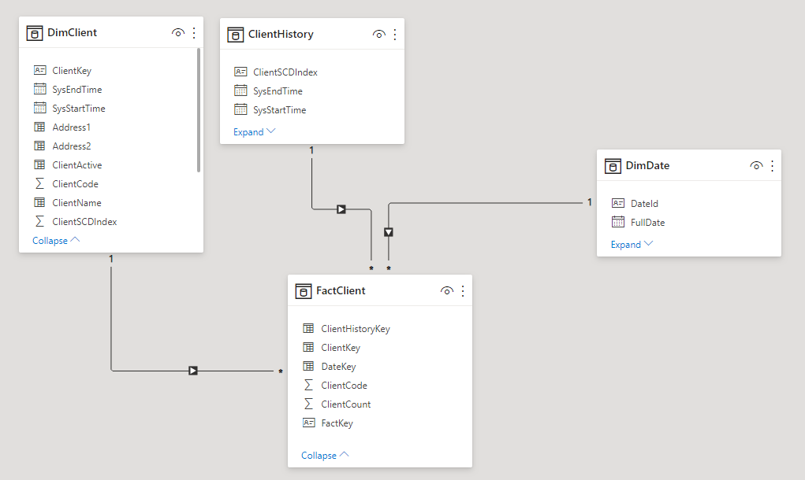

# Temporal Table SCD

Temporal Tables offer an easier route to capturing data changes as [1](https://www.timmitchell.net/post/2019/04/02/using-temporal-tables-for-slowly-changing-dimensions/) and [2](https://www.sqlservercentral.com/articles/slowly-changing-dimensions-using-t-sql-merge) find. There are a few steps required to shape the data ready for ingestion into a multidiemsional Tabular model. 
In this article a simple toy Client example is used to show one possible execution.

## Client Report
Resulting report showing client currrent and history 

## Tabular Model
Simple model with Factless fact table and associated dimensions

The above example shows a SSAS Tabular model which is imported into Power BI Desktop. The model can also be created in Power BI Desktop from imported SQL dimension and fact views 

